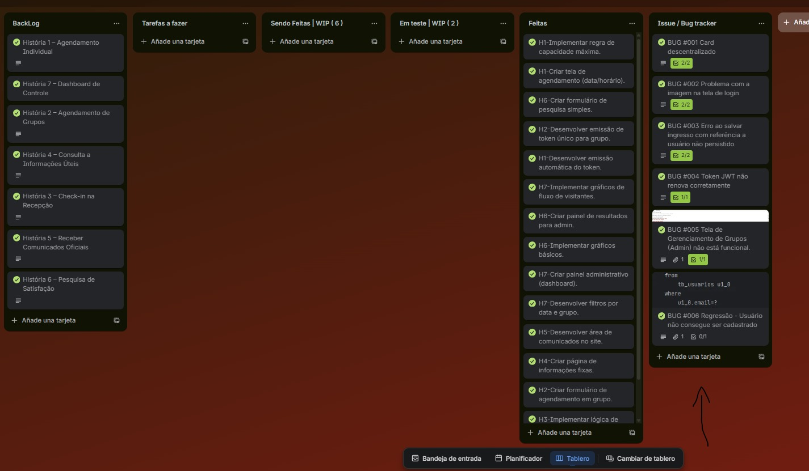
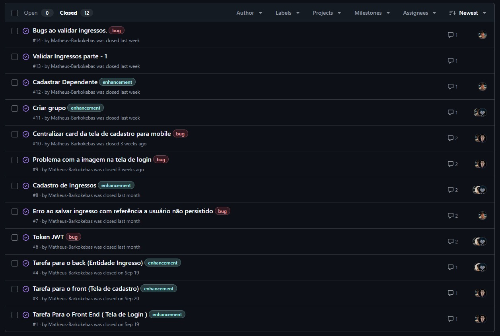

# Connecta Brennand

O Conecta Brennand é um projeto acadêmico criado por estudantes de Sistemas de Informação, com o propósito de unir arte, cultura e tecnologia. Nosso foco é transformar a experiência de visitação ao Parque de Esculturas Francisco Brennand, tornando-a mais acessível, interativa e conectada.

# Entregas 1 e 2

## 📋 Backlog 

<a href="https://trello.com/b/XQcU1FLY/conecta-brennand" target="_blank">📌 Link do Backlog (Trello)</a> 

[📥 Story Mapping (PDF)](arq_readme/pdfs/story_mapping.pdf)

## 🎨 Protótipo LOFI  

 
    
📌 LOFI 

    
[📥 LOFI ](arq_readme/videos/prototipo.mp4)

<a href="https://www.figma.com/design/oD8xXARlBrFMrmwXd5vwZ4/BRENANND?node-id=0-1&t=8y1TsaoAFsldXZ4M-1" target="_blank">📌 Link do Protótipo (Figma)</a>

<a href="https://youtu.be/98x69mlxzLY" target="_blank">📌 Link do Screencast (Youtube)</a>

 
    
📌 BDD - Gherkin 

    
[📥 BDD - Gherkin (PDF)](arq_readme/pdfs/bdd_gherkin.pdf)

## Bug tracker
<a href="https://trello.com/b/XQcU1FLY/conecta-brennand" target="_blank">📌 Link do Backlog (Trello)</a> (Bug tracker presente em forma de lista e cartão)

<a href="https://github.com/Matheus-Barkokebas/conecta-brennand/issues" target="_blank">📌 Link do issues github</a> (Bug tracker no github, servindo para revisão grupal do código em caso de correção de bugs)

# Entrega 3

<a href="https://youtu.be/Z3DHngNrD3E?si=22O8SHDcayx3vbsu" target="_blank">📌 Link do Screencast para Entrega 3 (Youtube)</a>

<a href="https://www.youtube.com/watch?v=5MTQUZJf3V8" target="_blank">📌 Link para os Teste Automatizados (Youtube)</a>

<a href="https://trello.com/b/XQcU1FLY/conecta-brennand" target="_blank">📌 Link do Bug tracker (Trello)</a> (Bug tracker presente em forma de lista e cartão)

<a href="https://github.com/Matheus-Barkokebas/conecta-brennand/issues" target="_blank">📌 Link do issues github</a> (Bug tracker no github, servindo para revisão grupal do código em caso de correção de bugs)

# Entrega 4

<a href="" target="_blank">📌 Link do Screencast para Entrega 4 (Youtube)</a>

<a href="" target="_blank">📌 Link para os Teste Automatizados (Youtube)</a>

<a href="https://github.com/Matheus-Barkokebas/conecta-brennand/wiki/Conecta-Brennand-%E2%80%94-Guia-de-Instala%C3%A7%C3%A3o" target="_blank">📌 Link da documentação para montar o ambiente </a> ( WIKI feita no github )

<a href="https://trello.com/b/XQcU1FLY/conecta-brennand" target="_blank">📌 Link do Bug tracker (Trello)</a> (Bug tracker presente em forma de lista e cartão)

<a href="https://github.com/Matheus-Barkokebas/conecta-brennand/issues" target="_blank">📌 Link do issues github</a> (Bug tracker no github, servindo para revisão grupal do código em caso de correção de bugs)

## 👥 Equipe

### Matheus Barkokebas  
**Líder do Projeto | Líder de Desenvolvimento**  
📧 mbbc@cesar.school  

- Organizar etapas, prazos e equipe  
- Definir arquitetura e padrões técnicos  
- Apoiar na resolução de problemas técnicos  
- Atuar no desenvolvimento back-end e front-end, garantindo integração do sistema  

---

### Flávio Barbosa  
**Designer | Desenvolvedor Front-End**  
📧 fbsj@cesar.school  

- Definir interface do sistema, com foco em usabilidade e identidade visual  
- Desenvolver o Google Sites para apresentação do projeto  

---

### José Vitor de Sousa  
**Quality Assurance | Desenvolvedor Back-End**  
📧 jvslx@cesar.school  

- Desenvolver o back-end do sistema  
- Realizar testes de qualidade  
- Garantir integração com banco de dados, performance e confiabilidade da aplicação  

---

### Nestor de Franca  
**Desenvolvedor Full Stack**  
📧 nmmf@cesar.school  

- Criar e integrar a interface do usuário  
- Desenvolver lógica de negócio e estrutura de dados da aplicação  

---

### Pedro Henrique  
**Desenvolvedor Back-End**  
📧 phct@cesar.school  

- Estruturar lógica e regras de negócio do sistema  
- Desenvolver integração com banco de dados  
- Garantir segurança e performance da aplicação  

---

### Tiago Abraão  
**Desenvolvedor Full Stack**  
📧 taol@cesar.school  

- Criar e integrar a interface do usuário  
- Desenvolver lógica e dados que sustentam a aplicação  

---

### Luiz Eduardo  
**Designer | Desenvolvedor Front-End**  
📧 lemm@cesar.school  

- Definir interface do sistema, garantindo usabilidade e identidade visual  
- Desenvolver o Google Sites para apresentação do projeto  

